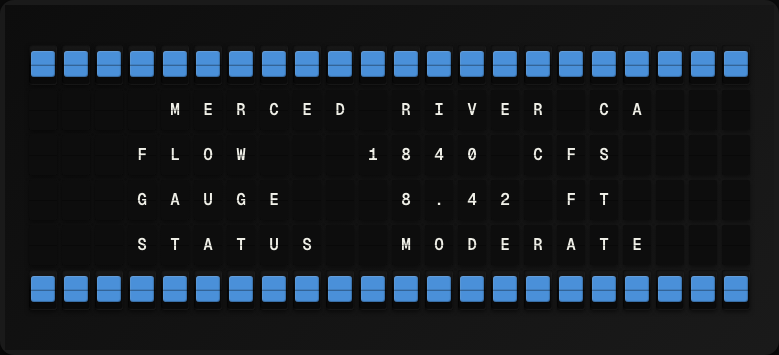

# River Flow Plugin

Display real-time streamflow data from a USGS water monitoring station.



**→ [Setup Guide](./docs/SETUP.md)**

## Overview

The River Flow plugin queries USGS Water Services for real-time discharge (streamflow) data at a configured monitoring station. It shows the current flow rate and whether the river is above or below the historical median. No API key required.

## Template Variables

| Variable | Description | Example |
|---|---|---|
| `river_flow.site_name` | USGS monitoring station name | `Guadalupe R nr Gilroy` |
| `river_flow.flow_cfs` | Current discharge in cubic feet per second | `245.0` |
| `river_flow.status` | Flow status relative to historical median | `Above normal` |
| `river_flow.last_updated` | Timestamp of last measurement | `2026-05-01 12:00` |

## Example Templates

```
RIVER FLOW
{{river_flow.site_name}}
Flow: {{river_flow.flow_cfs}} cfs
{{river_flow.status}}
{{river_flow.last_updated}}

```

## Configuration

| Setting | Name | Description | Required |
|---|---|---|---|
| `site_number` | USGS Site Number | USGS monitoring station site number (e.g. 11169000 for Guadalupe River). | Yes |

## Features

- USGS real-time streamflow data
- Configurable monitoring station
- Flow status relative to historical median
- No API key required

## Author

FiestaBoard Team
